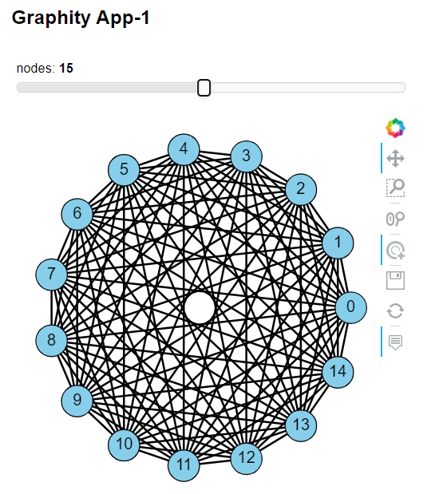

# NetworkX-and-HoloViz-for-Network-Science-Apps
Creating network science-themed web apps with NetworkX, and HoloViz's hvPlot and Panel in Python

todo: add dropdowns for selecting topology (scale-free, random, . . . ), graph layout algorithm, etc.
